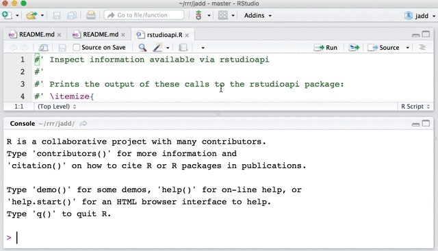

## RStudio addins

RStudio addins let you execute a bit of R code or a Shiny app through the 
RStudio IDE, either via the *Addins* dropdown menu or with a keyboard shortcut. 
Coupled with functions from the 
[rstudioapi](https://cran.r-project.org/web/packages/rstudioapi/index.html) 
package, this means you can operate on your own R code, which is awesome.

  * RStudio docs on addins (with examples): <https://rstudio.github.io/rstudioaddins/>
  * [addinslist](https://github.com/daattali/addinslist#readme) is an R package from Dean Attali that helps you discover and install addins.

## jadd

This package holds a couple addins I've made that have nothing to do with any specific package.

### `rstudioapi_addin`

This is sort of meta. This addin calls functions from the [rstudioapi](https://cran.r-project.org/web/packages/rstudioapi/index.html) package that you might use in your own addin. You can select text (or not) and activate the source editor (or the Console), then call this addin to expose all the information available returned by these functions:

  * `getActiveProject()`
  * `getActiveDocumentContext()`
  * `getSourceEditorContext()`
  * `getConsoleEditorContext()`
  * `primary_selection(getSourceEditorContext()`

Results are both `print()`ed and `str()`ed. It's not beautiful, but it gets the job done. You are in a better to position to program with these functions after you see the gory details with your own eyes.

To use this addin:

  * Run very recent RStudio IDE and `rstudioapi` package (see above)
  * `devtools::install_github("jennybc/jadd")`
  * Look for "Explore the RStudio API" in the *Addins* menu

### `assign_defaults_addin`

The `assign_defaults_addin` helps you develop and debug a function. Scenario: 
you're working on a function and need to walk through the body as if it were 
top-level code. But it is a PITA to set all the arguments to their default 
values. So you just fiddle with the function at arms length, convinced you can 
spot the problem and fix it this way. Sure you can.

Define your function. Select its name and *Addins > Assign default values* will
make assignments to the global environment. Arguments that have a default will
be set to that value. Arguments with no default are ignored -- you must set
those to something sensible yourself. And `...` must be dropped, so have fun
with that too! Fix your function. When you're feeling lucky, restart R to clean
out global environment and load/test the function properly.

To use this addin:

  * Run very recent RStudio IDE and `rstudioapi` package (see above)
  * `devtools::install_github("jennybc/jadd")`
  * Look for "Assign default values" in the *Addins* menu

### Observations on the development process

Take with a grain of salt, because I have ~~two~~ ~~four~~ eight entire hours of experience at this point.

  * Every addin deserves a demo gif.
  * The addin function shall not be a monster function. Make it as small as possible and put the smarts in other functions.
    - Why? So the discrete pieces of smarts are easier to develop and test. Maybe even reuse in other addins?
  * Addins live inside an R package, so take advantage of that, e.g. write tests and some documentation.
  * If your addin operates on a text selection, you don't have complete freedom to call the relevant rstudioapi functions during interactive development.
    - Why not? Because your manipulation of the selection and cursor position during development might not be compatible with the usage you want to test.
    - This is why I created the `rstudioapi` addin -- so I can select arbitrary text or put the cursor in an editor windows or the Console AND see what the rstudioapi functions return.
  * **Question**: Is the model "one package per addin" or "one addin package per person" or ???
  * **Question**: My *Addins* menu seems to show all the addins that are ?within packages on my `.libPaths()`?. I bet people will start to put addins in their normal packages, i.e. packages don't exist solely for the purpose of making an addin. Are those really all going to show up in my *Addins* menu all the time? Will there be a way to say "this addin only makes sense when package \<x\> is explicitly loaded"?
