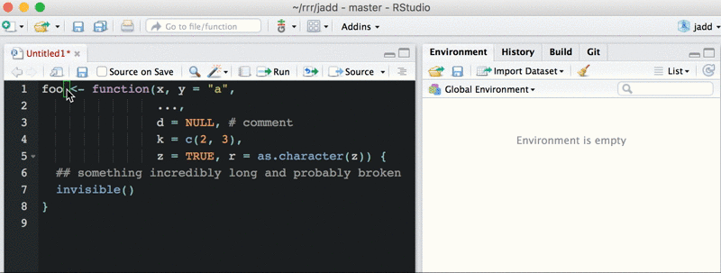

## RStudio addins

RStudio addins let you execute a bit of R code or a Shiny app through the 
RStudio IDE, either via the *Addins* dropdown menu or with a keyboard shortcut. 
Coupled with functions from the [`rstudioapi`](https://cran.r-project.org/web/packages/rstudioapi/index.html) package, this means you can operate
on your own R code, which is awesome.

RStudio docs on addins (with examples): 
<https://rstudio.github.io/rstudioaddins/>

To use addins:

  * Run RStudio v0.99.878 or later
    - <https://www.rstudio.com/products/rstudio/download/preview/>
  * Run `rstudioapi` package v0.5 or later
    - `install.packages("rstudioapi", type = "source")`
  * Populate your *Addins* dropdown menus with some examples
    - `devtools::install_github("rstudio/addinexamples", type = "source")`

These recent addins / Shiny gadgets inspired me to try my hand at this:

  * TJ Mahr's [WrapRmd addin](https://github.com/tjmahr/WrapRmd) which wraps R Markdown text *without mangling inline R code*
  * Aimee Gott's [`tidyshiny`](https://github.com/MangoTheCat/tidyshiny) which puts an [interactive front-end on `tidyr::gather()`](http://www.mango-solutions.com/wp/2016/03/a-gadget-for-tidyr/). I look forward to her treatment of `tidyr::spread()`, which tends to feel like putting toothpaste back in the tube to me.

### `assign_defaults_addin`

The `assign_defaults_addin` helps you develop and debug a function. Scenario: 
you're working on a function and need to walk through the body as if 
it were top-level code. But it is a PITA to set all the arguments to their
default values. So you just fiddle with the function at arms length, convinced you can spot the problem and fix it this way. Sure you can.

Select the argument section of your function definition and
*Addins > Assign default values* will make assignments to the global 
environment. Arguments that have a default will be set to that value. Arguments 
with no default are ignored -- you must set those to something sensible 
yourself. And `...` must be dropped, so have fun with that too! When you're feeling lucky, restart R to clean out global environment and load/test the function properly. I tried to allow for some sloppiness with the selection, but I'm sure there's room for improvement.

To use this addin:

  * Run very recent RStudio IDE and `rstudioapi` package (see above)
  * `devtools::install_github("jennybc/jadd")`
  * look for it in the *Addins* menu

### Observations on the development process

Take with a grain of salt, because I have ~2 entire hours of experience at this point.

  * Every addin deserves a demo gif.
  * The addin function shall not be a monster function. Make it as small as possible and put the smarts in other functions.
  * Why? So the discrete pieces of smarts are easier to develop and test. Maybe even reuse in other addins?
  * Addins live inside an R package, so take advantage of that, e.g. write tests and some documentation.
  * **Question**: Is the model "one package per addin" or "one addin package per person" or ???
  * **Question**: If your addin operates on a text selection, it feels impossible to develop this function in the usual way. As in, you can't do `devtools::load_all()` then simultaneously have some relevant text selected AND execute the main addin function on it. I had to do "Build & Reload" and run the actual addin from the menu. Am I missing something? This was another reason to shift functionality out of the addin function.
